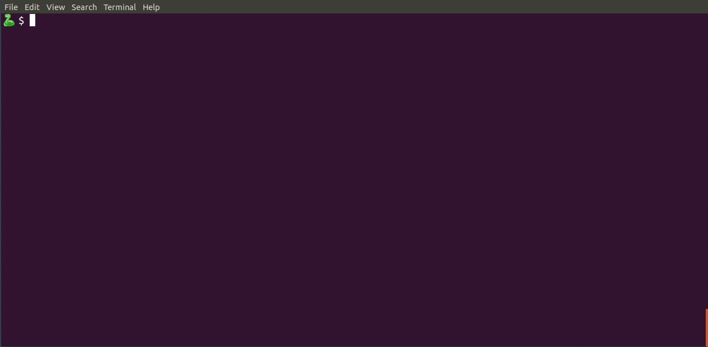

# 🐍 - Write Python with Emojis

Write Python code using emojis 🐍



## Inspiration

[Marc Garcia](http://datapythonista.github.io/) gave a wonderful [lightning talk](https://www.youtube.com/watch?v=Wtm7Iy-wEUI&t=52m43s) at [EuroSciPy 2018 in Trento](https://www.euroscipy.org/2018/), where he pointed out some obvious [deficiencies](https://github.com/python/cpython/pull/1686) in Python's handling of unicode. For instance, code like the following is not supported:

```python
import pandas as 🐼
```


## Installation

🐍 is available on [PyPI](https://pypi.org/project/pythonji). Install it with `pip`:

```
$ python -m pip install pythonji
```


## Using 🐍

🐍 installs as `pythonji`. 🐍 code files have the suffix `.🐍`. You can run a 🐍 code file as follows:

```console
$ pythonji file.🐍
```


## Example

Save the following code to the file `🐼.🐍`:

```python
import pandas as 🐼
from numpy import random as 🔀

# Define a dataframe and print it to the console
📋 = 🐼.DataFrame(
    {
        "😀": ["🐼", "🐍", "🦁"],
        "🏷️": ["Panda", "Python", "Lion"],
        "💯": 🔀.randint(2, 5, size=3),
    },
).set_index("😀")
print(📋)

# Do some arithmetic with the dataframe
🔤 = f" Pythonji {' '.join(📋.index)}"
🔢 = 📋.loc["🐍", "💯"] + 📋.loc["🐼", "💯"]
print(🔤 * 🔢)
```

You can run the code as follows:

```console
$ pythonji 🐼.🐍 
        🏷  💯
😀           
🐼   Panda  2
🐍  Python  2
🦁    Lion  4
 Pythonji 🐼 🐍 🦁 Pythonji 🐼 🐍 🦁 Pythonji 🐼 🐍 🦁 Pythonji 🐼 🐍 🦁
```


## Limitations

- 🐍 currently only handles single script files. It can import any regular Python module, but unfortunately not 🐍 modules.
- Sadly, `pip` does not currently handle unicode command names. Ideally, we want the executable to be named `🐍` instead of `pythonji`.
- [Black](https://black.readthedocs.io) unfortunately can not handle 🐍 code. Does anybody want to contribute to ⬛, a formatter for 🐍?
